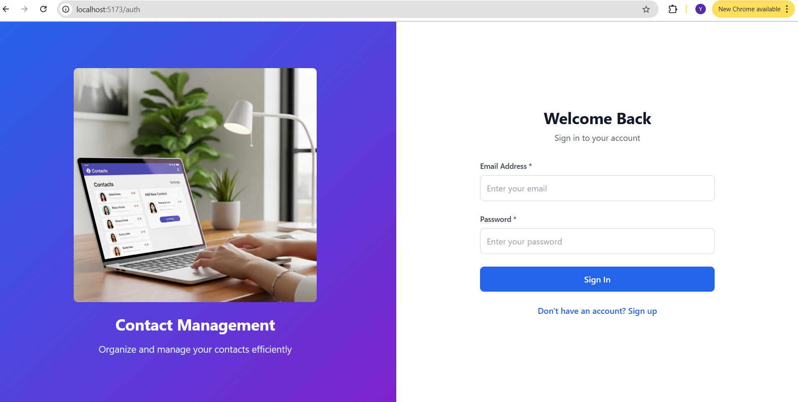
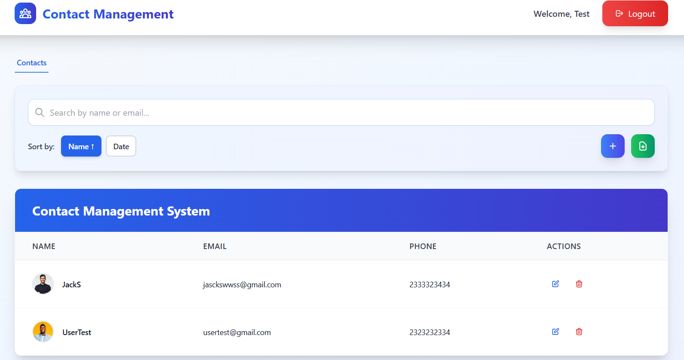
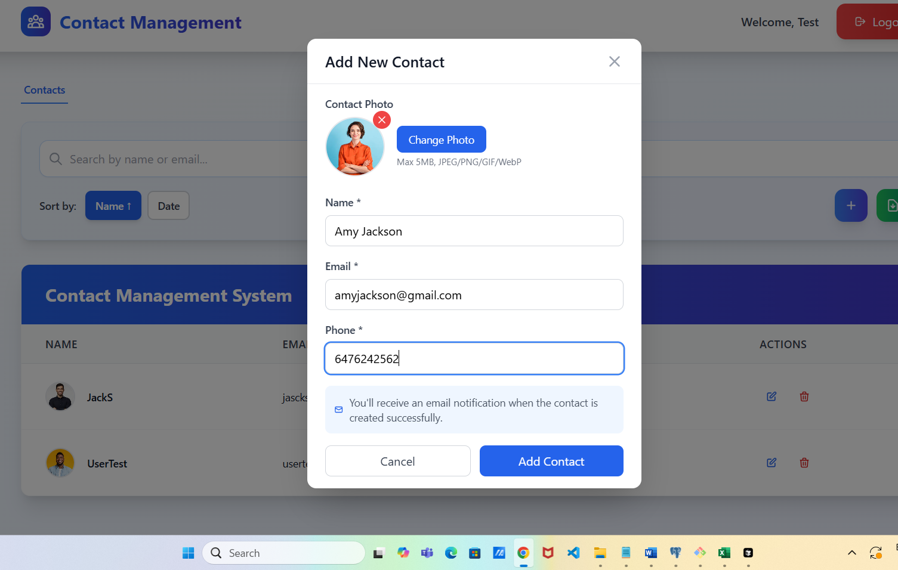
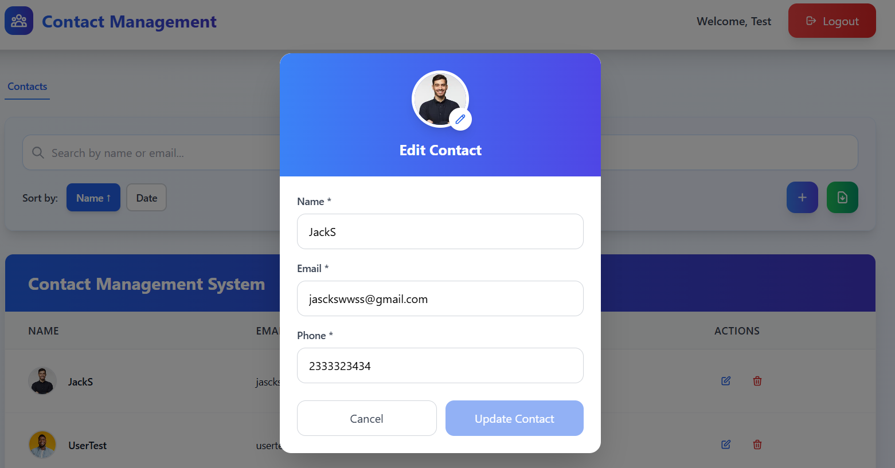
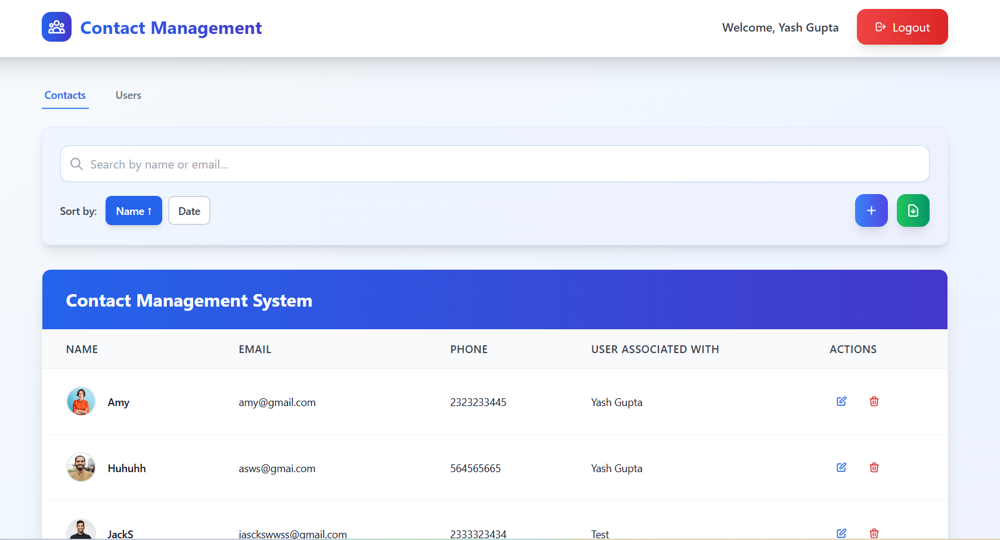
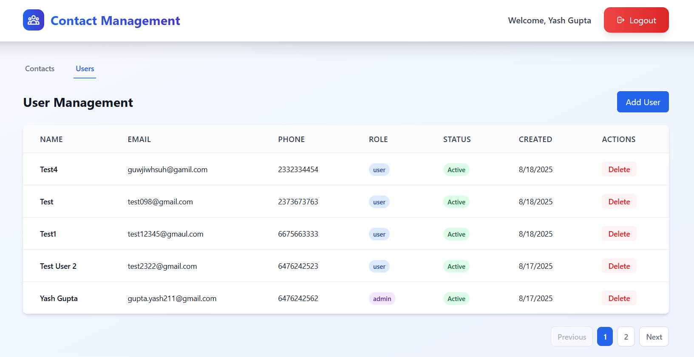
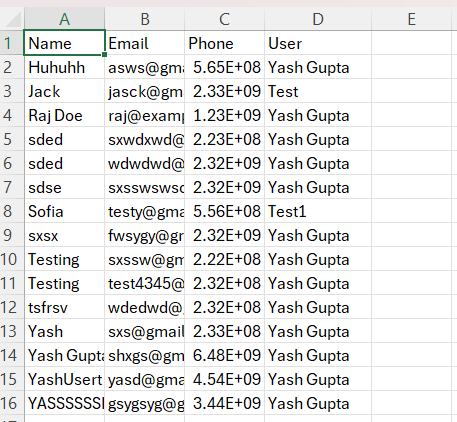
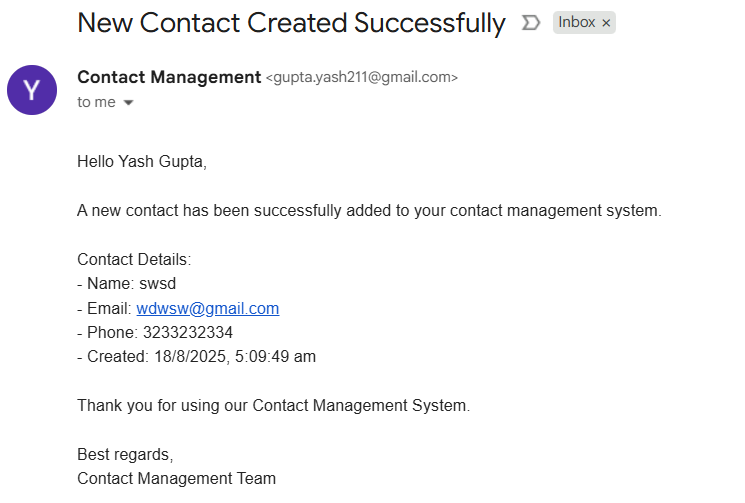

# 🔥 Contact Management Application

A full-stack Contact Management System built with **Nest.js**, **React**, and **PostgreSQL**. Features JWT authentication, role-based access control, photo uploads, pagination, search, and advanced features like Excel export and email notifications.

## 🚀 Quick Setup

### Prerequisites
- Node.js (v18+)
- PostgreSQL (v12+)

### Installation
```bash
# Clone and setup
git clone <repository-url>
cd user-contact-management

# Backend setup
cd backend
npm install
cp .env.example .env  # Configure database and JWT secret
npm run migration:run
npm run start:dev

# Frontend setup (new terminal)
cd ../frontend
npm install
npm run dev
```

### Environment Variables
**Backend (.env):**
```env
DB_HOST=localhost
DB_PORT=5432
DB_USER=postgres
DB_PASSWORD=your_password
DB_NAME=user_contacts
JWT_SECRET=your_secret_key
JWT_EXPIRES_IN=24h
PORT=3000
```

**Frontend (.env):**
```env
VITE_API_BASE_URL=http://localhost:3000/api
```

## 📸 Application Screenshots

### 🔐 Authentication


### 👥 User Dashboard


### 📝 Contact Management



### 👨‍💼 Admin Features



### 📊 Advanced Features



## 📚 API Endpoints

### Authentication
- `POST /auth/register` - Register new user
- `POST /auth/login` - User login

### Contacts (Protected)
- `GET /contacts` - Get all contacts (with pagination, search, sorting)
- `POST /contacts` - Create contact (with photo upload)
- `GET /contacts/:id` - Get specific contact
- `PUT /contacts/:id` - Update contact
- `DELETE /contacts/:id` - Delete contact

### User Management (Admin Only)
- `GET /users` - Get all users (with pagination, search, filtering)
- `PUT /users/:id` - Update user
- `DELETE /users/:id` - Delete user

### Query Parameters
- `page` - Page number (default: 1)
- `limit` - Items per page (default: 10, max: 100)
- `search` - Search by name/email
- `sortBy` - Sort field (name, email, createdAt)
- `sortOrder` - Sort order (ASC, DESC)
- `role` - Filter by role (admin only)

## 🔗 Interactive API Documentation

**Swagger UI:** `http://localhost:3000/api/docs`

Access the interactive API documentation to:
- View all endpoints with detailed schemas
- Test API calls directly from the browser
- See request/response examples
- Understand authentication requirements

## 🛠 Tech Stack

**Backend:** Nest.js, PostgreSQL, TypeORM, JWT, Passport, Multer, Swagger
**Frontend:** React 19, Redux Toolkit, Tailwind CSS, Vite
**Features:** File upload, pagination, search, Excel export, email notifications

## 👨‍💻 Author

**Yash Gupta**
- GitHub: [@yash211](https://github.com/yash211)